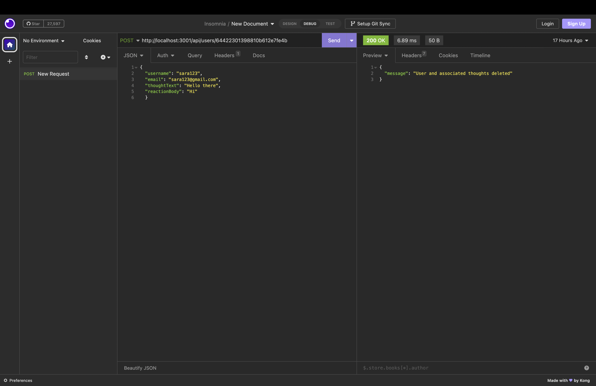

<h1>e-commerce</h1>

## Table of Contents

  * [Description](#description)
  
  * [Installation](#installation)

  * [Usage](#usage)

  * [Links](#links)

  * [Questions](#questions)

## Description

- My motivation was to create a back-end code so thata user could create, update, delete data in Insomnia without using the browser.
- I built this project to learn how to use Mongoose and better improve my knowledge in Insomnia and using routes such as get, post, put, and delete requests.
- It allows user to manage the backend of thier social network by creating usernames, adding and deleting friends, creating thoughts and reactions and being able to delete and edit them as well.
- Learned how to write api endpoints and test them using Insomnia.

## Installation

- Clone code from GitHub repository:
- Open in VS Code and command-line terminal.
- Open Insomnia to manage inventory.

## Usage
  
 - After starting the server 'node index.js' in command-line terminal, open Insomnia and use url to create a username and manage friends, add/edit/delete thoughts, and add/delete reactions.

    
 

## Links

- GitHub: https://github.com/Caliza/socialNetwork

- Google Drive: https://drive.google.com/file/d/1TMHBERp3N48ytpjh45W0RupGUh_Kx_Ix/view?usp=sharing

- Screencastify: https://watch.screencastify.com/v/dbtTKb5FKlArd2Dr7k7A

## Questions

- For any additional questions on usage of application, please contact at rances.rodriguez@gmail.com.